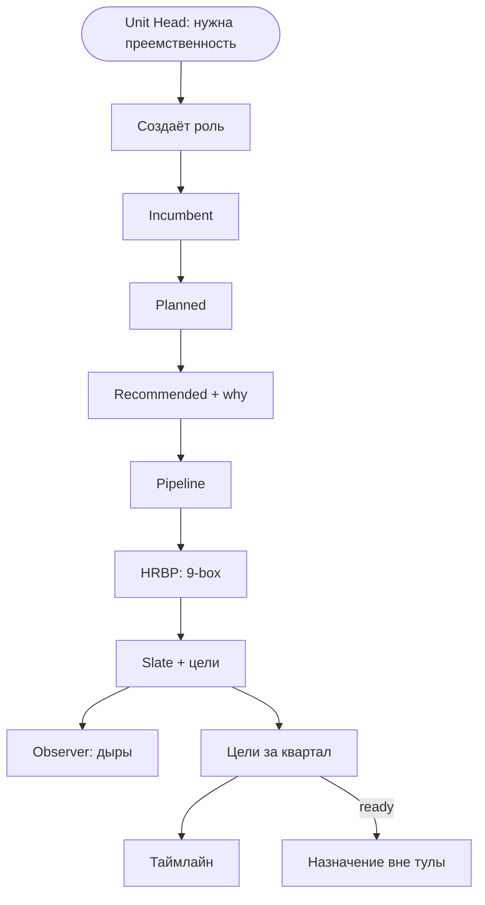

# Successor Planning Prototype

Прототип succession planning для юнита аутсорс-компании (~150–200 инженеров).

https://github.com/camorazrushimoe/successor-planning-prototype

## Роли

В v1 три учётки + переключатель в шапке для демо.

| Роль | Кто | В сервисе |
|---|---|---|
| **Unit Head** | Руководитель юнита ~200 | Роли, planned, цели, горизонт |
| **HRBP** | HR юнита | 9-box, не ставит primary |
| **Observer** | Руководитель Unit Head | Только дыры и coverage |

Кандидат slate не видит. Тула не назначает на роль.

## Демо

Сценарий 8 мин, актёры, why-строка, emergency vs successor: **[docs/DEMO.md](docs/DEMO.md)**.

Каст не из генератора: [data/demo-cast.json](data/demo-cast.json).

## Флоу



## Документы

- [docs/SPEC.md](docs/SPEC.md)
- [docs/UI.md](docs/UI.md)
- [docs/DEMO.md](docs/DEMO.md)
- [docs/DATA.md](docs/DATA.md)

## Данные

```bash
python3 scripts/generate_seed.py
```
