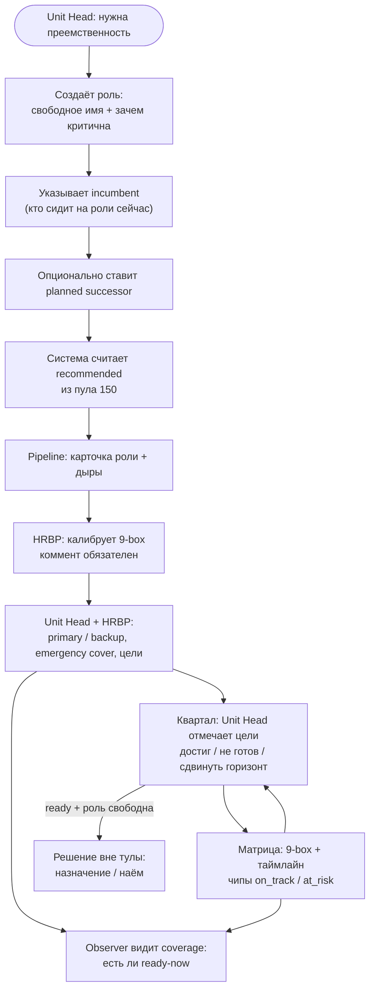

# Successor Planning Prototype

Прототип succession planning для юнита аутсорс-компании (~150–200 инженеров).

https://github.com/camorazrushimoe/successor-planning-prototype

## Роли

В v1 три учётки. Остальное — данные, не логин.

| Роль | Кто | Делает в сервисе |
|---|---|---|
| **Unit Head** | Руководитель юнита на ~200 человек | Владелец плана. Создаёт критические роли, ставит incumbent и planned, двигает горизонт, отмечает цели |
| **HRBP** | HR юнита | Калибрует 9-box, комментирует slate, флаг «нужен ассессмент». Не назначает primary без Unit Head |
| **Observer** | Руководитель Unit Head (БУ / дирекция / country) | Только смотрит: покрытие ролей, дыры, ready-now. Без правок править slate |

Не логинятся в v1:

- **Incumbent** — текущий холдер роли, поле в карточке.
- **Successor / candidate** — человек в slate; свои цели увидит позже.
- **Line manager кандидата** — источник толков в данных, не отдельный экран.

Observer нужен именно как «смотрит и не трогает»: если на двух партнёрских ролях нет ready-now — это риск дирекции, не только юнита.

## Флоу работы



Короткий цикл:

1. Unit Head заводит роль → incumbent → planned.
2. Система показывает recommended.
3. HRBP калибрует 9-box на ревью.
4. Вместе собирают slate и цели развития.
5. Раз в квартал Unit Head отмечает прогресс — таймлайн живёт.
6. Observer смотрит только итог: где дыра.

Тула не назначает на роль. Она держит доказательства готовности.

## Документы

- [docs/SPEC.md](docs/SPEC.md) — продукт и фреймворки
- [docs/UI.md](docs/UI.md) — экраны
- [docs/DATA.md](docs/DATA.md) — схема JSON

## Данные

```bash
python3 scripts/generate_seed.py
# data/unit.json — 150 людей + 8 ролей
```

Пример человека: [data/people.sample.json](data/people.sample.json).
